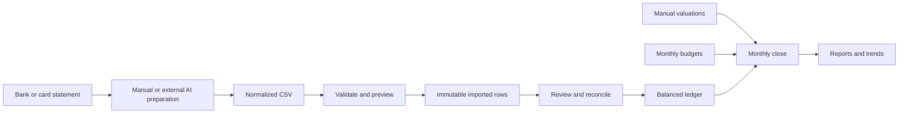

# Development Plan

This plan turns [PRODUCT.md](PRODUCT.md) into a local, monthly financial-review application while keeping infrastructure and automation deliberately simple.

## Confirmed Decisions

- Local-only web app running on macOS.
- TypeScript, Next.js, and SQLite.
- Single configurable currency.
- No authentication; rely on macOS and FileVault.
- No bank synchronization.
- No built-in AI initially.
- External AI prepares normalized CSV files.
- Original statements and CSV files are not retained.
- Imported rows and source metadata remain traceable.
- Simple monthly category budgets without rollover.
- Minimal double-entry ledger hidden from the interface.
- Statement cycles and calendar reporting months remain independent.

## Target Architecture



Use a single Next.js application:

- Server Components for reading data.
- Server Actions for forms and financial operations.
- Route Handlers only where file upload, download, or backup handling requires them.
- SQLite accessed through Drizzle and `better-sqlite3`.
- Zod for validation.
- `csv-parse` for CSV processing.
- Vitest for domain and database tests.
- Playwright for critical end-to-end workflows.
- No separate backend, containers, queues, state-management framework, or network services.

Financial data should live outside the repository, under the macOS Application Support directory. The server must bind only to `127.0.0.1`.

---

## Phase 0: Freeze the Financial Rules

### Goal

Remove accounting and import ambiguity before implementing the database.

### Work

Create the initial documentation:

- [docs/accounting-rules.md](docs/accounting-rules.md)
- [docs/csv-import-v1.md](docs/csv-import-v1.md)
- [docs/month-close.md](docs/month-close.md)
- [docs/external-ai-prompt.md](docs/external-ai-prompt.md)
- [docs/test-scenarios.md](docs/test-scenarios.md)

Define these rules explicitly:

- Money is stored as integer minor units, never floating point.
- Calendar dates use `YYYY-MM-DD` without timezone conversion.
- `transaction_date` describes when an event happened.
- `posted_date` describes when the institution finalized it.
- `effective_date` determines the reporting month.
- Statement dates determine reconciliation and coverage.
- Card payments and owned-account transfers are not income or expenses.
- Refunds reduce the related expense category.
- Unknown information remains unresolved.
- Imported source fields are immutable.
- Corrections are recorded rather than silently overwriting history.

Define the normalized CSV convention:

- Positive amounts increase the tracked account's net financial position.
- Negative amounts decrease it.
- Checking deposit: positive.
- Checking expense: negative.
- Credit-card purchase: negative.
- Credit-card payment or refund: positive.

Create synthetic examples for:

- Salary.
- Bank expense.
- Credit-card purchase.
- Card payment.
- Refund.
- Split transaction.
- Duplicate row.
- Transfer.
- Statement closing on the 15th.
- Late-posted transaction.
- Opening balance.
- Loan principal and interest.

### Exit Criteria

- Every example has an agreed effective date, amount direction, category treatment, and ledger result.
- The CSV contract can be given to any external AI model without additional explanation.
- No implementation begins while sign or date rules remain ambiguous.

---

## Phase 1: Application Foundation and Local Data Safety

### Goal

Create a dependable local application shell and database lifecycle.

### Work

Scaffold the Next.js application with strict TypeScript, linting, and formatting.

Use this approximate structure:

```text
src/app/                     Routes and page composition
src/components/              Shared interface components
src/domain/                  Pure financial rules
src/db/                      Schema, connection, and migrations
src/features/accounts/
src/features/imports/
src/features/ledger/
src/features/reconciliation/
src/features/budgets/
src/features/month-close/
src/features/net-worth/
src/features/reports/
src/server/                  Data paths, backups, and local security
test-fixtures/               Synthetic statements and CSVs
```

Implement:

- SQLite connection and generated SQL migrations.
- Foreign-key enforcement.
- WAL mode and safe synchronization settings.
- Database transactions for multi-step operations.
- Configurable database path for development and testing.
- Production data under macOS Application Support.
- Loopback-only server binding.
- Global error boundaries and useful error messages.
- Initial automatic backup before database migrations.
- A health check for database integrity.
- Base-currency onboarding.
- Application shell and navigation.

Initial navigation:

- Dashboard.
- Accounts.
- Imports.
- Transactions.
- Budgets.
- Net worth.
- Monthly close.
- Settings.

### Exit Criteria

- A fresh installation creates and migrates its database.
- Restarting preserves data.
- The app is inaccessible from other devices on the local network.
- A failed migration does not destroy the previous database.
- Automated tests can create isolated temporary databases.

---

## Phase 2: Accounts, Categories, and Ledger Foundation

### Goal

Establish the trusted financial core before accepting imports.

### Core Records

Implement database models for:

- Application settings.
- Financial accounts.
- Internal ledger accounts.
- User-facing categories.
- Journal entries.
- Ledger postings.
- Audit events.

Financial account types:

- Checking.
- Savings.
- Cash.
- Credit card.
- Loan.
- Other asset account.
- Other liability account.

Account settings include:

- Name.
- Institution.
- Type.
- Currency.
- Opening date.
- Whether it is required for monthly close.
- Active or archived status.

Internal ledger account types:

- Asset.
- Liability.
- Income.
- Expense.
- Equity.
- Transfer clearing.

### Ledger Behavior

Each financial event creates postings whose amounts total exactly zero.

Examples:

- Grocery purchase: checking `-82.45`, groceries expense `+82.45`.
- Card purchase: card liability `-82.45`, groceries expense `+82.45`.
- Salary: checking `+2,000`, salary income `-2,000`.
- Card payment: checking `-500`, card liability `+500`.
- Refund: credit card `+40`, original expense category `-40`.

The interface should never require the user to understand debit and credit terminology.

Implement:

- Opening balances offset against opening equity.
- Flat income and expense categories.
- Custom category creation.
- Category archival rather than deletion.
- Manual ledger-entry form for cash and adjustments.
- Database and service-level balance invariants.
- Source type on every journal entry: import, manual, opening balance, or system.

### Exit Criteria

- Unbalanced journal entries cannot be stored.
- Account balances can be reproduced entirely from postings.
- Card payments produce no income or expense.
- Archived accounts and categories retain historical reports.
- All accounting fixture scenarios pass automated tests.

---

## Phase 3: Versioned CSV Import and Preview

### Goal

Safely accept externally prepared data without trusting it automatically.

### CSV Contract

Version 1 should require:

```csv
transaction_date,description,amount,currency
```

Optional columns:

```csv
posted_date,external_id,merchant,type,category,notes
```

Only one account and one statement period should be included per upload.

The upload form collects statement-level information separately:

- Account.
- Statement start date.
- Statement end date.
- Opening balance.
- Closing balance.
- Source filename.

### Import Pipeline

Implement:

1. Choose the account.
2. Enter statement metadata.
3. Select a CSV.
4. Read it in memory.
5. Compute its checksum.
6. Validate headers and every row.
7. Convert decimal amounts to minor units.
8. Display errors by line number.
9. Show a complete preview.
10. Commit all rows atomically or commit nothing.

Validation includes:

- UTF-8 and common BOM handling.
- Quoted commas and line breaks.
- ISO dates.
- Currency matching the configured base currency.
- Decimal precision.
- Empty required fields.
- Unknown transaction types.
- Unknown category suggestions.
- Dates outside the expected statement period.
- File and row limits.
- Exact file re-upload detection.

Store:

- Source filename.
- File checksum.
- CSV schema version.
- Import timestamp.
- Statement metadata.
- Every normalized source row.
- Original row number.
- Validation and review status.

Do not store:

- The original statement.
- The uploaded CSV bytes.
- AI conversation content.

Add:

- Downloadable CSV template.
- Downloadable example CSV.
- Copyable external-AI prompt.
- Import history page.
- Safe cancellation before commit.

### Exit Criteria

- Invalid files cannot partially alter the database.
- Exact re-upload does not create duplicate transactions.
- Every imported row points to its filename, checksum, batch, and row number.
- Unrecognized AI suggestions remain unresolved.
- Imported source values cannot be edited after commitment.

---

## Phase 4: Transaction Review, Duplicates, and Statement Reconciliation

### Goal

Turn imported rows into trusted financial evidence.

### Review Inbox

Provide filters for:

- Needs category.
- Unknown transaction type.
- Suspected duplicate.
- Possible transfer.
- Date uncertainty.
- Reconciliation blocker.
- Ready to finalize.

Allow the user to:

- Confirm or change the effective date.
- Assign a category.
- Normalize the merchant name.
- Mark a row as a duplicate.
- Exclude a non-transaction row with a reason.
- Split one expense across several categories.
- Link a refund to its category.
- Add an explanatory note.

Edits should be stored as review decisions layered over immutable imported values.

### Duplicate Handling

Use separate levels:

- Exact file checksum: block automatically.
- Stable institution transaction ID: strong duplicate candidate.
- Same account, amount, date, and normalized description: weaker candidate.
- Similar transaction on overlapping statements: review candidate.

Never automatically delete a suspected duplicate. Legitimate identical purchases must remain possible.

### Reconciliation

Calculate:

```text
closing balance = opening balance + accepted account activity
```

Account type determines how user-entered balances are normalized internally.

A statement can be finalized only when:

- The difference is exactly zero.
- Every imported row has a decision.
- Excluded rows have reasons.
- Duplicate decisions are complete.
- The opening and closing balances are valid.

Never generate an unexplained balancing transaction.

### Exit Criteria

- A malformed AI extraction cannot reconcile accidentally.
- Duplicate extraction rows can be excluded without deleting evidence.
- A balance mismatch shows the exact difference.
- The user can trace reconciliation totals back to included rows.
- A finalized statement cannot be silently edited.

---

## Phase 5: Posting, Transfers, and Irregular Statement Coverage

### Goal

Convert reviewed statement rows into balanced ledger entries and support real statement cycles.

### Posting Workflow

When a statement is finalized:

- Generate balanced journal entries from accepted rows.
- Link each journal entry to its source row.
- Use the confirmed effective date for reports.
- Retain posted date and statement membership for reconciliation.
- Commit statement status and ledger postings atomically.

### Transfers

Suggest transfer matches when transactions have:

- Equal and opposite amounts.
- Different owned accounts.
- The same currency.
- Dates within a small configurable window.

Require confirmation.

Use a transfer-clearing account so each statement can be finalized independently:

- Checking payment: checking decreases, transfer clearing increases.
- Card payment: card liability improves, transfer clearing decreases.
- Matched legs cancel without creating income or expense.

Support explicit classifications for:

- Transfer between owned accounts.
- Card payment.
- Transfer to an untracked external account.
- Transfer from an untracked external account.
- Transfer still in transit.

### Coverage

Calculate statement coverage using actual intervals, not transaction dates.

Support:

- Statements ending on the 15th.
- Irregular statement dates.
- Overlapping periods.
- Gaps between periods.
- Accounts opened or closed mid-month.
- Accounts excluded from monthly closing.

For an August report, a card statement ending September 15 may provide the missing August 16-31 coverage.

Create a coverage page showing each account's status through the target month-end.

### Exit Criteria

- A card payment produces zero total income and expense.
- Statement cycles can cross calendar months.
- Overlaps do not duplicate economic events.
- Gaps are visible and block month closure.
- Effective-date reporting and posted-date reconciliation coexist correctly.
- Every ledger posting traces back to an imported row or explicit manual entry.

At this point, the application has a trustworthy transaction ledger.

---

## Phase 6: Manual Assets, Liabilities, and Net Worth

### Goal

Represent the parts of financial life that do not have transaction statements.

### Work

Add manual items for:

- Property.
- Vehicles.
- Investments tracked by value only.
- Private loans owed to the user.
- Loans or debts without imported statements.
- Other assets and liabilities.

Each item has:

- Name.
- Asset or liability classification.
- Optional description.
- Active dates.
- Valuation frequency.
- Dated valuation history.

Each valuation has:

- Effective date.
- Value.
- Source note.
- Manual or imported origin.
- Carry-forward acknowledgment.

Rules:

- Never track the same item as both a ledger account and a manual item.
- Old values can be carried forward but are visibly marked stale.
- Valuation changes are not automatically treated as income or spending.
- Deleting an item means archiving it; valuation history remains.

Calculate month-end net worth from:

- Ledger balances for tracked financial accounts.
- Latest valid manual valuation as of month-end.
- Assets less liabilities.

### Exit Criteria

- Net worth can be reproduced for any supported month-end.
- Every component shows its source and valuation date.
- Stale valuations are clearly identified.
- Assets and liabilities can be added without creating artificial income.
- Debt movement is visible separately from spending.

---

## Phase 7: Budgets, Month Closure, and Core Reports

### Goal

Complete the central monthly-review experience.

### Budgets

Implement:

- One target per expense category and calendar month.
- Copy previous month.
- Edit future or open-month budgets.
- Planned versus actual.
- No rollover.
- No envelope allocation.
- Transfers excluded.
- Refunds reduce category spending.

### Month Readiness

A month can close only when:

- The previous month is closed, except initial onboarding.
- Every required active account has continuous reconciled coverage through month-end.
- Relevant statements are finalized.
- Transactions effective in that month are categorized.
- Duplicates are resolved.
- Transfers are matched or explicitly classified.
- Manual items have current valuations or acknowledged carry-forward values.
- No unexplained adjustments remain.

The app calculates the close date from account coverage. It does not assume the 15th or month-end.

### Closing

Closing creates an immutable revision containing:

- Close timestamp.
- Included statement imports.
- Ledger cutoff.
- Account balances.
- Manual valuations.
- Budget values.
- Report totals.
- Outstanding acknowledgments.

A late transaction affecting a closed month requires explicit reopening. The previous revision remains available for audit, and later months become provisional until recalculated.

### Core Reports

Produce:

- Income.
- Expenses.
- Savings amount.
- Savings rate.
- Budget planned versus actual.
- Spending by category.
- Debt movement.
- Net worth and change.
- Account balances.
- Missing or stale information.

Every aggregate must drill down to transactions or valuation records.

### Exit Criteria

- A calendar month with a card closing on the 15th closes correctly once later coverage arrives.
- Provisional and closed months are visually distinct.
- Closing is blocked with specific actionable reasons.
- Reopening cannot silently erase the previous result.
- Report totals match ledger postings exactly.
- Every report number has a source drill-down.

This is the functional MVP milestone.

---

## Phase 8: Decision-Focused Dashboard and Monthly Insights

### Goal

Make the correct financial data understandable and useful.

### Dashboard

Show:

- Last closed month.
- Current provisional month.
- Net worth and change.
- Income, expenses, and savings rate.
- Budget categories needing attention.
- Debt movement.
- Import and coverage status.
- Outstanding review tasks.
- Stale valuations.

### Insights

Use deterministic calculations rather than AI:

- Largest spending categories.
- Largest month-over-month increases.
- New merchants.
- Categories over budget.
- Repeated descriptions that may be subscriptions.
- Income changes.
- Debt increasing or decreasing.
- Net-worth change explained by cash flow versus valuation changes.

Insights should state facts without judgment.

Examples:

- "Dining spending increased by $120 compared with July."
- "Your Visa statement currently covers August only through the 15th."
- "The vehicle valuation is four months old."

### Interface Quality

Add:

- Clear empty states.
- Keyboard-accessible forms.
- Responsive layouts.
- Consistent amount and date formatting.
- Loading and error states.
- Confirmation for destructive or month-reopening actions.
- Minimal charts only where trends are easier to understand visually.

### Exit Criteria

- The dashboard answers the core questions in [PRODUCT.md](PRODUCT.md).
- No dashboard value lacks source traceability.
- Incomplete information is never presented as final.
- A complete monthly review can be performed without navigating through database-oriented terminology.

---

## Phase 9: Recovery, Export, and Release Hardening

### Goal

Ensure the app can safely hold real financial history.

### Backup and Restore

Implement:

- SQLite online backup API rather than copying a live WAL database.
- Backup before migrations.
- Backup before reopening or destructive corrections.
- One automatic daily backup on first launch.
- Retention of recent and monthly backups.
- Database integrity check after backup.
- Restore preview and confirmation.
- Recovery documentation.

### Exports

Provide:

- Full SQLite snapshot for exact restoration.
- Portable versioned CSV/JSON export.
- Accounts.
- Categories.
- Transactions and postings.
- Budgets.
- Manual valuations.
- Month-close revisions.
- Checksums and base-currency metadata.

Exports must clearly warn that they contain sensitive data.

### Testing

Unit tests:

- Money parsing and formatting.
- Date and effective-month rules.
- Balanced postings.
- Statement coverage interval merging.
- Duplicate fingerprints.
- Transfer exclusion.
- Budget calculations.
- Savings-rate edge cases.
- Net-worth calculations.

Database integration tests:

- Migrations.
- Foreign keys and constraints.
- Atomic import rollback.
- Import idempotency.
- Reconciliation.
- Closing and reopening.
- Backup restoration.
- Report queries.

CSV fixtures:

- BOM.
- CRLF.
- Quoted commas.
- Embedded newlines.
- Invalid dates.
- Excess precision.
- Missing headers.
- Duplicate IDs.
- Overlapping statements.
- Statement closing on the 15th.

Playwright workflow:

1. Configure currency.
2. Create accounts.
3. Import bank and card statements.
4. Resolve duplicates.
5. Match card payment.
6. Reconcile statements.
7. Add asset valuation.
8. Create budget.
9. Close month.
10. Inspect report.
11. Export backup.

Use only synthetic financial information in the repository and tests.

### Release Checks

- No network calls or telemetry containing financial data.
- Local server listens only on loopback.
- No original uploaded files remain on disk.
- Database and backup locations are documented.
- Migrations are tested from every released schema.
- Errors never leave partially committed imports.
- A clean machine setup is documented.
- Full backup and restoration are manually verified.

---

## Post-v1 Backlog

Explicitly defer these until the monthly workflow proves useful:

- Built-in AI or OCR.
- Bank synchronization.
- Cloud hosting.
- Authentication.
- Multiple currencies and exchange rates.
- Desktop packaging with Tauri or Electron.
- Database passphrase encryption.
- Mobile applications.
- Budget rollover and envelopes.
- Financial goals and sinking funds.
- Investment lot and market-price tracking.
- Automatic categorization rules.
- Advanced recurring-payment detection.
- Debt payoff simulations.
- Cash-flow forecasting.
- Shared or multi-user finances.
- Raw PDF statement storage.

## Milestones

1. **Safe import: Phases 0-3**
   - The app can validate and retain normalized statement data safely.
2. **Trusted ledger: Phases 4-5**
   - Statements reconcile, transfers behave correctly, and irregular coverage is understood.
3. **Functional MVP: Phases 6-7**
   - Net worth, budgets, and monthly closing satisfy the core product goal.
4. **Usable v1: Phases 8-9**
   - The experience is understandable, backed up, exportable, and safe for real financial history.

## Definition of Done

Version 1 is complete when normalized statements from multiple accounts can be imported, reconciled, and traced to their source; transfers and duplicates can be resolved; manual assets can be updated; a calendar month can be closed despite irregular statement dates; and every resulting income, expense, budget, and net-worth number can be explained.
